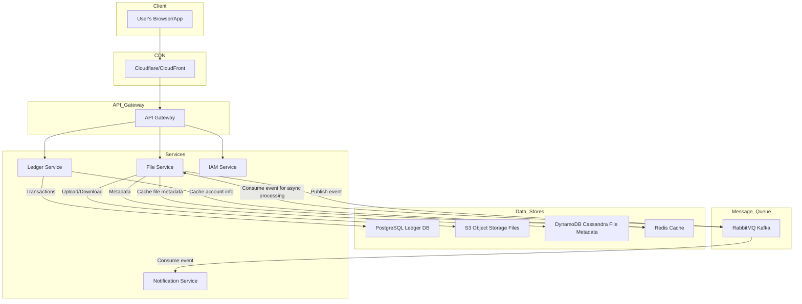
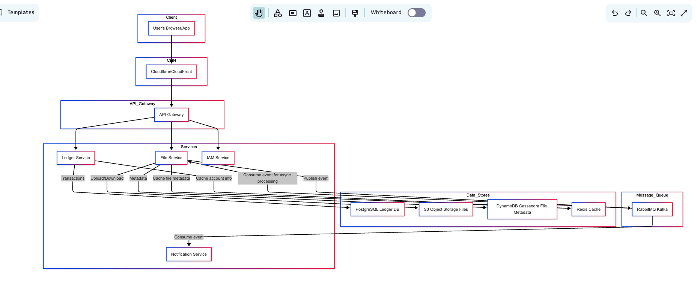
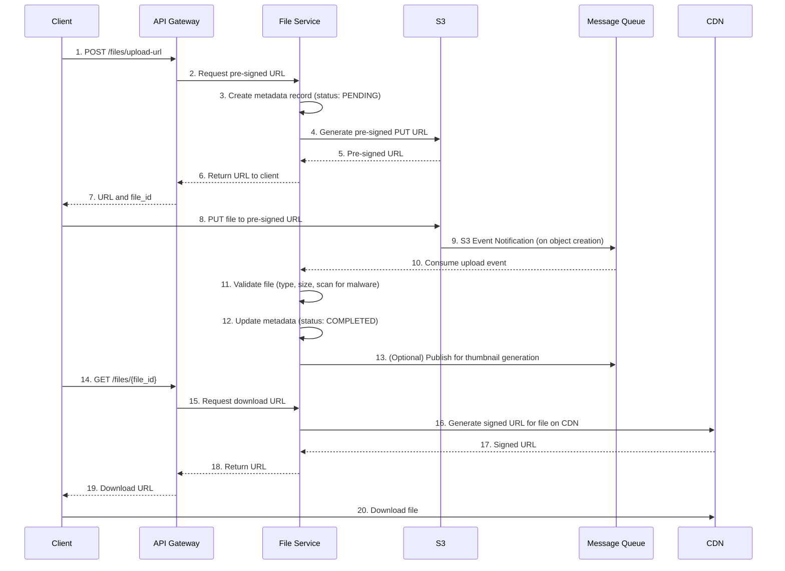
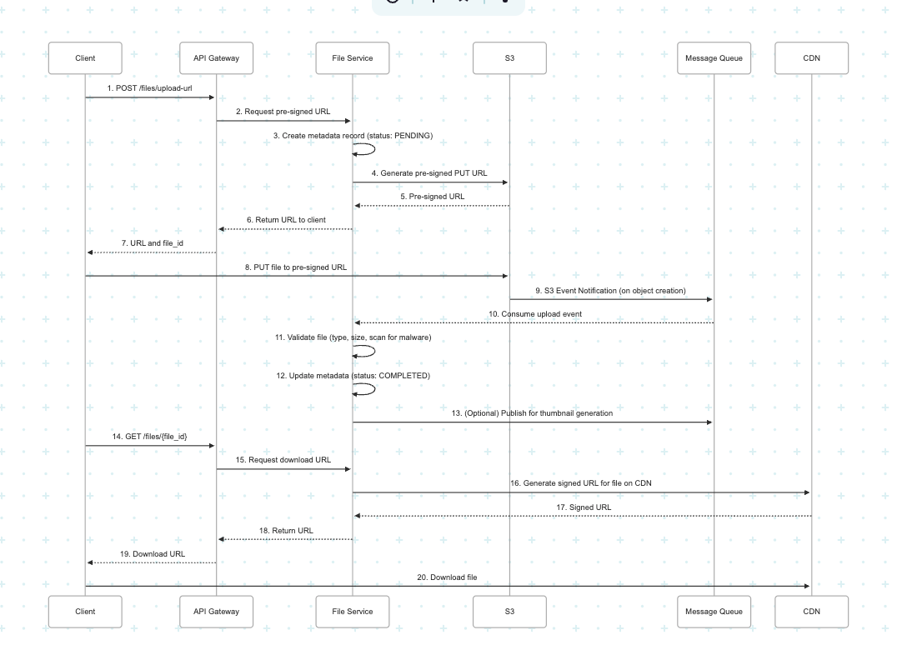
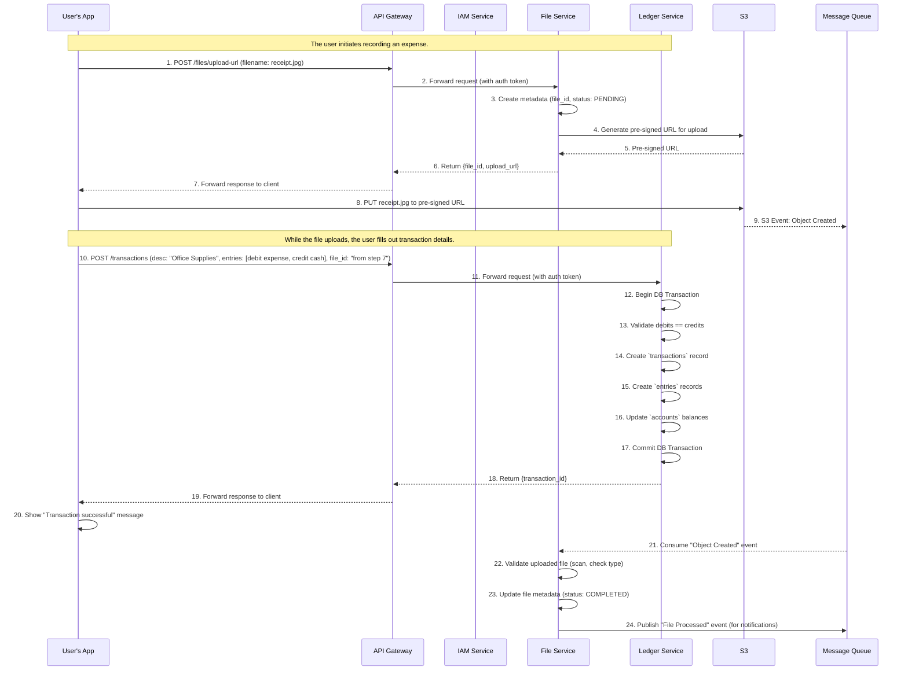
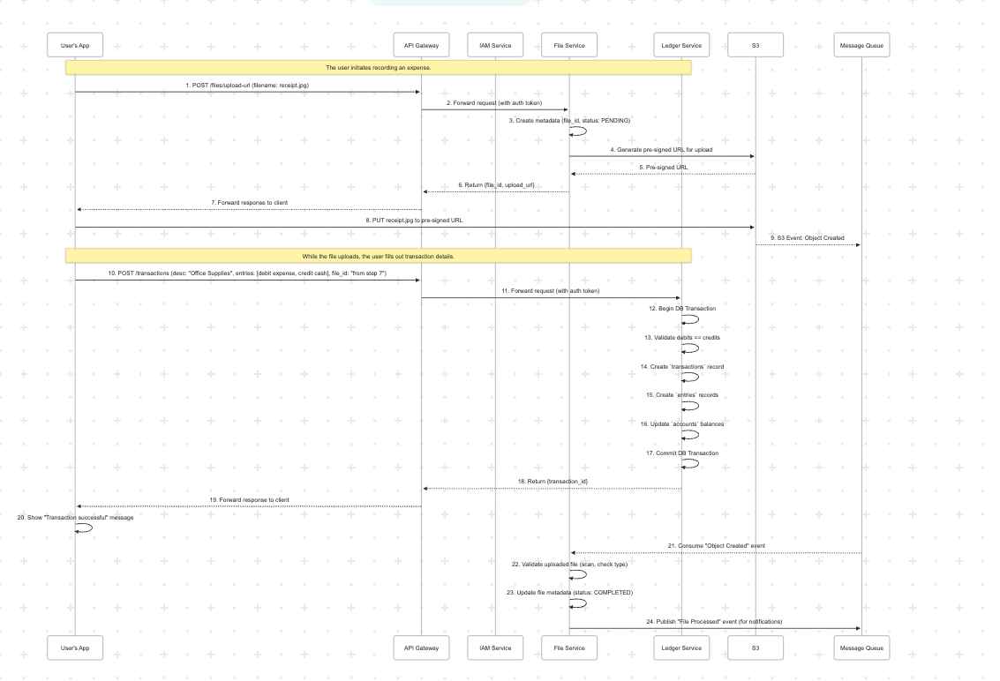

# System Design for a Financial Events and File Attachment Service

This document outlines the system design for a backend service that records financial events using double-entry accounting and allows users to attach files to these events.

## 1. Overall Architecture

The proposed architecture is based on a microservices pattern. This approach offers scalability, fault isolation, and technology-agnostic development for different parts of the system. The core idea is to separate the financial transaction logic from the file handling logic.

Here is a high-level diagram of the architecture:





### Components:

*   **API Gateway**: The single entry point for all client requests. It handles routing, authentication, rate limiting, and caching.
*   **IAM (Identity & Access Management) Service**: Manages user authentication and authorization. It will issue tokens (e.g., JWT) that will be used to authenticate requests to other services.
*   **Ledger Service**: The core of the accounting system. It's responsible for creating and validating financial transactions based on double-entry principles.
*   **File Service**: Handles all file-related operations: generating pre-signed URLs for uploads, processing files, storing metadata, and serving files.
*   **Notification Service**: Sends asynchronous notifications to users (e.g., email, push notifications) after certain events, like a successful file upload and processing.
*   **Message Queue (RabbitMQ/Kafka)**: Decouples services and handles asynchronous tasks like file processing, thumbnail generation, and notifications.
*   **Databases**:
    *   **PostgreSQL**: A relational database for the `Ledger Service` to ensure ACID compliance for financial transactions.
    *   **Amazon S3 (or other object storage)**: For storing the actual files. It's highly scalable, durable, and cost-effective.
    *   **DynamoDB/Cassandra**: A NoSQL database to store file metadata. It's chosen for its high availability and scalability for read/write operations.
*   **CDN (Content Delivery Network)**: Used to cache and serve files to users globally with low latency.

## 2. Data Models and Storage

### 2.1. Ledger Service Data Model (PostgreSQL)

We need three main tables for the double-entry ledger.

*   `accounts`: Stores information about each account (e.g., Cash, Accounts Receivable).
*   `entries`: Records individual debit and credit operations.
*   `transactions`: Groups a set of entries that represent a single financial event. A transaction must have balanced debits and credits.

**`accounts` table:**
```sql
CREATE TABLE accounts (
    id UUID PRIMARY KEY,
    name VARCHAR(255) NOT NULL,
    type VARCHAR(50) NOT NULL, -- ASSET, LIABILITY, EQUITY, REVENUE, EXPENSE
    balance DECIMAL(20, 2) NOT NULL DEFAULT 0.00,
    created_at TIMESTAMPTZ NOT NULL DEFAULT NOW(),
    updated_at TIMESTAMPTZ NOT NULL DEFAULT NOW()
);
```

**`entries` table:**
```sql
CREATE TABLE entries (
    id UUID PRIMARY KEY,
    transaction_id UUID NOT NULL REFERENCES transactions(id),
    account_id UUID NOT NULL REFERENCES accounts(id),
    amount DECIMAL(20, 2) NOT NULL,
    direction VARCHAR(10) NOT NULL, -- DEBIT or CREDIT
    created_at TIMESTAMPTZ NOT NULL DEFAULT NOW()
);
CREATE INDEX idx_entries_transaction_id ON entries(transaction_id);
CREATE INDEX idx_entries_account_id ON entries(account_id);
```

**`transactions` table:**
```sql
CREATE TABLE transactions (
    id UUID PRIMARY KEY,
    description TEXT,
    created_at TIMESTAMPTZ NOT NULL DEFAULT NOW()
);
```

### 2.2. File Service Data Model

**File Metadata (DynamoDB/Cassandra):**
A NoSQL database is a good choice here for scalability and fast lookups.

*   **Table Name**: `file_metadata`
*   **Primary Key**: `file_id` (UUID)
*   **Attributes**:
    *   `file_id`: UUID
    *   `transaction_id`: UUID (optional, can be linked after transaction is created)
    *   `user_id`: UUID
    *   `filename`: String
    *   `s3_key`: String (path to the file in S3)
    *   `file_type`: String (e.g., 'image/jpeg', 'application/pdf')
    *   `size_bytes`: Number
    *   `upload_status`: String ('PENDING', 'COMPLETED', 'FAILED')
    *   `previews`: Map (e.g., `{ "thumbnail_small": "s3_key_thumb_s.jpg" }`)
    *   `created_at`: Timestamp
    *   `updated_at`: Timestamp

**File Storage (Amazon S3):**
Files will be stored in an S3 bucket with a well-defined folder structure.
Example: `s3://<bucket-name>/<user_id>/<file_id>/<filename>`

## 3. API Contracts

The API will be exposed via the API Gateway.

### 3.1. Ledger Service API

#### `POST /transactions`
Creates a new financial transaction.

**Request Body:**
```json
{
  "description": "Payment for services",
  "entries": [
    {
      "account_id": "uuid-for-cash-account",
      "amount": "100.00",
      "direction": "DEBIT"
    },
    {
      "account_id": "uuid-for-revenue-account",
      "amount": "100.00",
      "direction": "CREDIT"
    }
  ]
}
```

**Success Response (201 Created):**
```json
{
  "transaction_id": "new-transaction-uuid",
  "status": "created"
}
```
**Error Response (400 Bad Request):**
*   If debits do not equal credits.
*   If an account does not exist.

### 3.2. File Service API

#### `POST /files/upload-url`
Requests a pre-signed URL to upload a file.

**Request Body:**
```json
{
  "filename": "invoice.pdf",
  "file_type": "application/pdf"
}
```
**Success Response (200 OK):**
```json
{
  "file_id": "new-file-uuid",
  "upload_url": "https://s3-presigned-url-for-upload"
}
```
Client will then use this URL to `PUT` the file directly to S3.

#### `GET /files/{file_id}`
Retrieves a file's metadata and a short-lived download URL.

**Success Response (200 OK):**
```json
{
    "file_id": "file-uuid",
    "filename": "invoice.pdf",
    "file_type": "application/pdf",
    "size_bytes": 123456,
    "download_url": "https://s3-presigned-url-for-download"
}
```

#### `POST /transactions/{transaction_id}/files`
Links an uploaded file to a transaction.

**Request Body:**
```json
{
    "file_id": "file-uuid"
}
```
**Success Response (200 OK):**
```json
{
    "status": "linked"
}
```

## 4. Double-Entry Enforcement and Atomicity

This is critical for the `Ledger Service`.

1.  **Database Transactions**: The creation of a transaction and its associated entries will be wrapped in a single database transaction in PostgreSQL.
    ```golang
    // Pseudocode in Go for Ledger Service
    func (s *LedgerService) CreateTransaction(ctx context.Context, description string, entries []*Entry) (string, error) {
        tx, err := s.db.BeginTx(ctx, nil)
        if err != nil {
            return "", err
        }
        defer tx.Rollback() // Rollback on error

        // 1. Validate that debits == credits
        var totalDebits, totalCredits decimal.Decimal
        for _, entry := range entries {
            if entry.Direction == "DEBIT" {
                totalDebits = totalDebits.Add(entry.Amount)
            } else {
                totalCredits = totalCredits.Add(entry.Amount)
            }
        }
        if !totalDebits.Equal(totalCredits) {
            return "", errors.New("debits do not equal credits")
        }

        // 2. Create the transaction record
        var transactionID string
        err = tx.QueryRowContext(ctx, "INSERT INTO transactions (description) VALUES ($1) RETURNING id", description).Scan(&transactionID)
        if err != nil {
            return "", err
        }

        // 3. Create entry records
        for _, entry := range entries {
            _, err := tx.ExecContext(ctx, "INSERT INTO entries (transaction_id, account_id, amount, direction) VALUES ($1, $2, $3, $4)", transactionID, entry.AccountID, entry.Amount, entry.Direction)
            if err != nil {
                return "", err // This will trigger the rollback
            }
            // 4. Update account balances
            var operator = "+"
            if entry.Direction == "CREDIT" {
                 // For Liability, Equity, Revenue: credit increases balance
                 // For Asset, Expense: credit decreases balance
                 // This logic depends on account type.
                 // A simple approach is to have a "normal_balance" field on account (CREDIT or DEBIT)
            } else { // DEBIT
                // ... similar logic for debit
            }
             _, err = tx.ExecContext(ctx, "UPDATE accounts SET balance = balance " + operator + " $1 WHERE id = $2", entry.Amount, entry.AccountID)
             if err != nil {
                return "", err
             }
        }

        return transactionID, tx.Commit() // Commit the transaction
    }
    ```
2.  **Constraints**: Database constraints will also be used to enforce data integrity.

## 5. File Ingestion and Delivery





*   **Hot vs. Cold Storage**: S3 lifecycle policies can automatically move older, less frequently accessed files to cheaper storage tiers (e.g., S3 Infrequent Access or Glacier) to save costs.
*   **Global Delivery**: A CDN like CloudFront will be configured with the S3 bucket as its origin. This will cache files at edge locations around the world for low-latency access.

### 5.1. Thumbnail and Preview Generation

As requested by the task, the system can optionally generate previews like thumbnails for images or first-page previews for PDFs. This is handled asynchronously to avoid blocking the user.

1.  **Trigger**: After the **File Service** validates a newly uploaded file (Step 11 in the diagram), it publishes an event like `file_ready_for_preview` to the **Message Queue**.
2.  **Dedicated Workers**: A separate pool of workers (or a specialized service, the `Preview Service`) consumes these events. This isolates the compute-intensive task of media processing from the core API services.
3.  **Processing**: For an image, the worker uses a high-performance library like `libvips` in Go to generate thumbnails of various sizes (e.g., 100x100, 600x600). For a PDF, it might use a tool like `ghostscript` to extract the first page as an image.
4.  **Storage**: The generated previews are saved back to the S3 bucket, typically with a descriptive name (e.g., `<original_s3_key>_thumb_100.jpg`).
5.  **Update Metadata**: The worker then updates the `previews` map in the file's metadata record in DynamoDB to include the S3 keys of the new previews. The frontend can then query this metadata to display the appropriate thumbnail.

## 6. Security Controls

*   **Authentication**: The `IAM Service` will handle user login and issue short-lived JWTs. The API Gateway will validate these tokens on every request.
*   **Authorization**: The system will use Role-Based Access Control (RBAC). For example, a user can only access files linked to their own transactions. This logic will be enforced in the `File Service` and `Ledger Service`.
*   **Encryption**:
    *   **In Transit**: TLS will be enforced for all communication between the client, CDN, API Gateway, and services.
    *   **At Rest**: Data in PostgreSQL and S3 will be encrypted at rest.
*   **File Validation**: The `File Service` will validate file types and sizes upon upload. It will also perform a virus scan on each uploaded file before it's marked as `COMPLETED`.
*   **Audit Logs**: All sensitive operations (e.g., creating a transaction, accessing a file) will be logged for auditing purposes.

## 7. Strategy for Scale and Global Access

The current section 7 is replaced with this more detailed one.

The system is designed to handle ~10 million financial transactions and ~50 million file uploads per month, with low-latency global access.

*   **Transactions**: 10M/month is ~3.8 transactions per second (TPS) on average.
*   **Uploads**: 50M/month is ~19 uploads per second on average.

We must design for peak loads, which can be 10x-100x the average. The strategy is as follows:

### 7.1. Scaling the Ledger Service (Handling ~400+ TPS Writes)

The write-heavy nature of the ledger is the primary database challenge.

*   **Database Choice**: We stick with PostgreSQL for its ACID compliance. For the scale required, we would use a managed service like Amazon Aurora or Google Cloud SQL, which simplifies management of replicas and scaling.
*   **Write Path Optimization**:
    *   **Connection Pooling**: Use a robust connection pooler like `PgBouncer` to manage database connections efficiently, which is critical for high throughput in Go applications.
    *   **Database Sharding**: This is the ultimate solution for write-intensive workloads. The database will be partitioned (sharded) based on a `tenant_id` or `user_id`.
        *   **Sharding Key**: `tenant_id` is often preferred in B2B systems. For a B2C system, a high-cardinality `user_id` is a good key. This ensures all data for a single user resides on the same shard, making queries efficient and avoiding costly cross-shard joins.
        *   **Implementation**: This can be managed by a proxy like `Citus` for PostgreSQL or implemented in the application layer. The `Ledger Service` would inspect the user's token, extract the sharding key, and route the database query to the correct shard.
*   **Read Path Optimization**:
    *   **Read Replicas**: For each shard, multiple read replicas will be deployed. All queries that do not need to be on the absolute latest data (e.g., generating an end-of-month report) will be directed to these replicas, freeing up the primary database for writes.
    *   **Caching (Redis)**: Frequently accessed, slowly changing data like account details and balances will be cached in Redis. This drastically reduces read load on the database for common operations.

### 7.2. Scaling the File Service & Ensuring Global Access (Handling ~2000+ Uploads/sec)

This service is stateless, making it easier to scale horizontally.

*   **Stateless, Horizontally-Scaled Service**: The `File Service` itself will be a containerized Go application running on a platform like Kubernetes (EKS) or ECS. An autoscaling policy will be set to add more container instances as CPU or memory usage increases, allowing it to handle virtually any number of requests for pre-signed URLs.
*   **Offloading to S3**: The core strategy is that the service *does not* handle the file upload stream. It only handles the lightweight metadata and URL generation. The multi-gigabyte bandwidth load is passed directly from the client to Amazon S3, which is built for massive, parallel throughput.
*   **Asynchronous Processing at Scale**: The file validation and preview generation is handled by workers consuming from a message queue.
    *   **Message Queue - Kafka**: At this scale, Apache Kafka is the preferred choice over RabbitMQ. Kafka's partitioned consumer model allows for incredible horizontal scaling. We can have hundreds of `File Service` workers in a consumer group, each processing messages from a subset of Kafka partitions in parallel.
*   **Global Low-Latency via CDN**:
    *   **Serving Files**: We will use a CDN like Amazon CloudFront with the S3 bucket as its origin. When a user requests to download a file, they are served from the CDN edge location physically closest to them, ensuring minimal latency.
    *   **S3 Cross-Region Replication**: To optimize for the *first* download in a new region (before it's cached by the CDN), we can use S3's Cross-Region Replication. We can have replicas of our primary bucket in key regions (e.g., `us-east-1`, `eu-west-1`, `ap-southeast-1`). Our `File Service` can be region-aware and generate a download URL pointing to the S3 bucket or CDN endpoint closest to the user.

## 8. Reliability and Failure Handling

*   **Idempotency**: `POST` endpoints that create resources should be idempotent. The client can send a unique `Idempotency-Key` in the header. The server will store this key and ensure the operation is only performed once.
*   **Retries**: For transient failures in inter-service communication, a retry mechanism with exponential backoff should be implemented.
*   **Dead-Letter Queues (DLQs)**: If a message from the queue fails to be processed after several retries (e.g., a corrupted file that cannot be processed), it will be moved to a DLQ for manual inspection.
*   **Backup and Restore**: PostgreSQL will have regular backups. S3 has built-in versioning and can be configured for cross-region replication for disaster recovery.

## 9. Observability and Monitoring

*   **Metrics**: Use Prometheus to collect key metrics from services:
    *   **Ledger Service**: Transaction throughput, error rate, latency.
    *   **File Service**: Upload/download rate, processing time, error rate.
*   **Logging**: Centralized logging (e.g., using the ELK stack) for all services.
*   **Tracing**: Distributed tracing (e.g., using Jaeger or OpenTelemetry) to trace requests as they flow through the microservices.
*   **Alerting**: Configure alerts in Grafana or Alertmanager for critical issues (e.g., high error rates, high latency, queue depth increasing).

## 10. Edge Cases

*   **Partial Failures**: The use of database transactions in the `Ledger Service` handles partial failures during the creation of a financial event. If any step fails, the entire transaction is rolled back.
*   **Invalid File Formats**: The `File Service` will reject files that do not match the allowed types or fail validation.
*   **Corrupted Uploads**: If a file uploaded to S3 is found to be corrupt during processing, its status will be marked as `FAILED` in the metadata database, and the user can be notified to try again.

## 11. Trade-offs and Alternatives Considered

Every system design involves trade-offs. Here are some key decisions and the reasoning behind them.

*   **Monolith vs. Microservices**:
    *   **Choice**: Microservices.
    *   **Reasoning**: The two core functions (Ledger and Files) have very different requirements. The Ledger demands consistency and ACID transactions, while the File service demands high throughput and scalability for large binary objects. Separating them allows us to choose the right tools and scale each component independently.
    *   **Trade-off**: We accept higher operational complexity (more services to deploy, monitor, and manage) in exchange for scalability and separation of concerns.

*   **SQL vs. NoSQL for the Ledger**:
    *   **Choice**: SQL (PostgreSQL).
    *   **Reasoning**: Financial data requires strict consistency and atomicity. Relational databases with ACID transaction support are the industry standard and the safest choice for this.
    *   **Alternative**: Using a NoSQL database like DynamoDB would require implementing complex transactional logic and rollback procedures in the application layer, which is error-prone and adds significant risk to the core business logic.

*   **Message Queue: Kafka vs. RabbitMQ**:
    *   **Choice**: Kafka.
    *   **Reasoning**: Given the scale (~50 million events per month from uploads alone), Kafka's high-throughput, persistent, and horizontally scalable nature is a better fit. Its ability to replay messages is also excellent for reliability and debugging.
    *   **Alternative**: RabbitMQ is an excellent general-purpose message broker, but Kafka's partitioned log architecture is generally superior for high-volume event streaming scenarios.

*   **Direct Upload vs. Pre-signed URL Pattern**:
    *   **Choice**: Pre-signed URLs.
    *   **Reasoning**: This pattern offloads the bandwidth and compute load of handling file streams from our backend services directly to a massively scalable service (S3). It prevents our `File Service` from becoming a bottleneck.
    *   **Trade-off**: It adds a bit of complexity to the client-side logic, which must now perform a two-step process (get URL, then PUT to URL). This is a very common and worthwhile trade-off.

## 12. End-to-End User Flow: Creating a Transaction with a Receipt

This section describes a typical user flow: a user records a business expense of $50 for "Office Supplies" and attaches a photo of the receipt.

Here is a sequence diagram illustrating the complete flow:




**Detailed Steps:**

1.  **User Initiates Upload**: The user clicks "Attach Receipt" on the frontend. The client application makes a `POST` request to the `/files/upload-url` endpoint via the **API Gateway**. This request includes the filename and type.
2.  **Get Pre-signed URL**: The **API Gateway** authenticates the request (using a JWT validated perhaps against the **IAM Service**) and forwards it to the **File Service**.
3.  **File Service Prepares for Upload**: The **File Service** creates a new metadata record in DynamoDB with a `PENDING` status. It then requests a secure, time-limited pre-signed URL from **Amazon S3**.
4.  **Client Uploads File**: The **File Service** returns the pre-signed URL and a unique `file_id` to the client. The client application uses this URL to upload the receipt image directly to **S3**. This offloads the bandwidth-intensive work from our services.
5.  **User Creates Transaction**: While the file is uploading in the background, the user fills in the transaction details (e.g., "Office Supplies," $50). Once the upload is complete, the client has the `file_id`. The user submits the form.
6.  **Ledger Service Records Transaction**: The client sends a `POST` request to the `/transactions` endpoint. The request body contains the description, the debit/credit entries, and the `file_id` of the attached receipt. The **API Gateway** routes this to the **Ledger Service**.
7.  **Atomicity is Key**: The **Ledger Service** performs the entire operation within a single PostgreSQL database transaction. It validates that debits equal credits, creates the transaction record, creates the associated entries, and updates the account balances. If any step fails, the entire database transaction is rolled back, ensuring data integrity. It also stores the `file_id` with the transaction.
8.  **Asynchronous File Processing**: When the file upload to **S3** completes (Step 4), S3 automatically sends an event notification to a **Message Queue** (like SQS or Kafka).
9.  **File Validation**: The **File Service** has a worker that consumes messages from this queue. Upon receiving the notification, it downloads the file from S3 (or accesses it), validates its content (e.g., runs a virus scan, confirms it's a valid image), and optionally generates thumbnails.
10. **Finalize Status**: After successful processing, the **File Service** updates the file's metadata record in DynamoDB, changing the status from `PENDING` to `COMPLETED`. If processing fails, it's marked as `FAILED`.
11. **Notifications (Optional)**: The **File Service** can publish another event (e.g., `file_processed`) to the message queue, which can be consumed by a **Notification Service** to inform the user that their receipt is successfully attached and processed.

This flow effectively decouples the file handling from the core financial transaction logic, improving scalability and user experience. The user gets a fast response for the transaction creation while heavy file processing happens asynchronously. 

**NOTE:** All diagrams were rendered using mermaid https://www.mermaidchart.com/. Render code here to confirm.